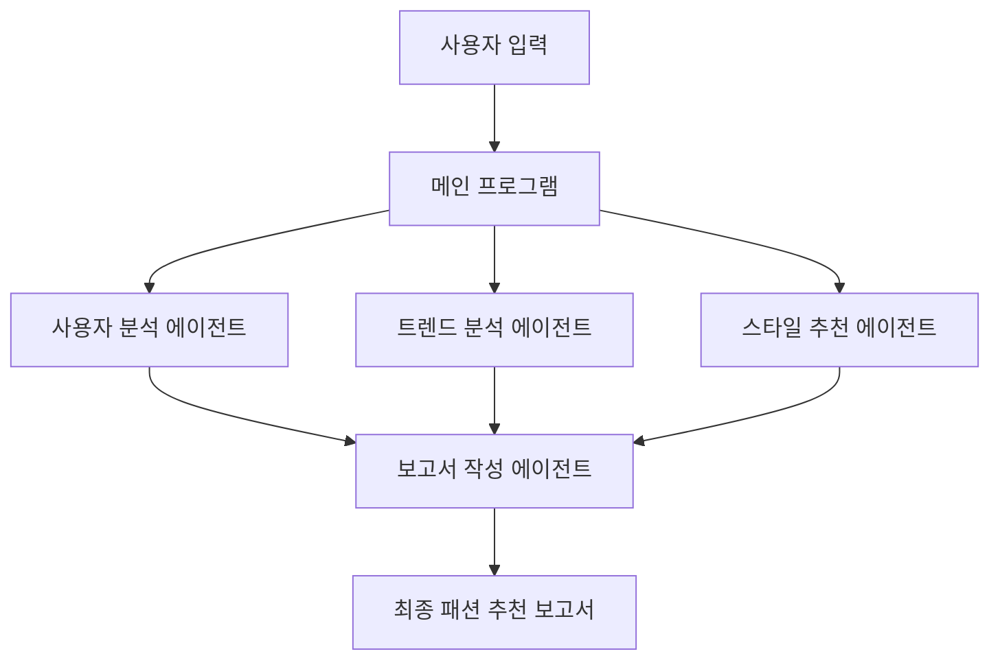

# AI 패션 스타일리스트 프로젝트

## 프로젝트 소개

AI 패션 스타일리스트는 패션에 큰 관심이 없는 사용자들을 위한 간단한 맞춤 코디 제안 서비스입니다. 사용자의 기본 정보, 상황, 그리고 예산을 고려하여 적절한 패션 스타일을 추천합니다. 현재는 로컬 환경에서 테스트용으로 작동하는 버전이며, 향후 웹 서비스로 발전시킬 계획입니다.

### 주요 기능

1. 사용자 분석: 입력받은 신체 정보를 바탕으로 체형 분석
2. 트렌드 분석: 현재 패션 트렌드를 고려한 스타일 제안
3. 맞춤형 스타일 추천: 사용자의 상황에 적합한 의류 아이템 추천
4. 예산 최적화: 사용자의 예산 내에서 구매 가능한 제품 추천
5. 종합 보고서 생성: 위의 모든 분석을 종합한 패션 제안 보고서 작성

## 시스템 구조



## 기술 스택

- streamlit>=1.24.0
- langchain-core>=0.3.0
- langchain-groq==0.2.0
- google-search-results==2.4.2
- wikipedia==1.4.0
- pydantic>=2.4.2
- wikipedia
- langchain
- langchain-community
- duckduckgo-search
- youtube-search-python
- arxiv
- python-dotenv
- watchdog

## 설치 방법

1. 레포지토리를 클론합니다:
   ```
   git clone https://github.com/yourusername/ai-fashion-stylist.git
   ```

2. 프로젝트 디렉토리로 이동합니다:
   ```
   cd ai-fashion-stylist
   ```

3. 필요한 패키지를 설치합니다:
   ```
   pip install -r requirements.txt
   ```

4. `.env` 파일을 생성하고 필요한 API 키를 추가합니다:
   ```
   GROQ_API_KEY=your_groq_api_key_here
   ```

## 사용 방법

1. 다음 명령어로 프로그램을 실행합니다:
   ```
   python main.py
   ```

2. 프롬프트에 따라 사용자 정보를 입력합니다:
   - 성별
   - 키
   - 체중
   - 예산
   - 스타일링이 필요한 상황

3. AI가 분석을 수행하고 패션 추천 보고서를 생성합니다.

4. 생성된 보고서를 확인하고 추천된 스타일을 참고하세요!

## 프로젝트 구조

```
ai-fashion-stylist/
│
├── main.py                 # 메인 실행 파일
├── custom_agent.py         # AI 에이전트 클래스 정의
├── agent_config.py         # 에이전트 설정 및 초기화
├── config.py               # 설정 파일
├── prompts.py              # AI 에이전트용 프롬프트 템플릿
├── user_input.py           # 사용자 입력 처리
├── requirements.txt        # 필요한 Python 패키지 목록
└── README.md               # 프로젝트 설명 문서
```

## 핵심 코드 설명

### 사용자 분석
```python
USER_ANALYST_PROMPT = f"""
당신은 20년 경력의 전문 이미지 컨설턴트입니다. 다음 고객 정보를 바탕으로 전문적이고 상세한 분석을 제공하세요:

{COMMON_USER_INFO}

1. 체형 분석 (200단어):
   a) BMI 계산 및 체형 분류 (구체적인 수치 제시)
   b) 체형의 장단점 분석 (최소 3가지씩)
   ...
"""
```

### 트렌드 분석
```python
TREND_ANALYST_PROMPT = f"""
당신은 세계적인 패션 매거진의 수석 트렌드 분석가입니다. 현재 날짜를 기준으로 고객의 상황과 예산을 고려한 실용적인 트렌드 분석을 수행하여 스타일리스트에게 제공하세요.

{COMMON_USER_INFO}

1. 글로벌 패션 트렌드 분석 (250단어):
   a) 현재 가장 주목받는 글로벌 패션 트렌드 5가지를 선별하여 상세히 설명
   ...
"""
```

### 스타일 추천
```python
STYLIST_PROMPT = f"""
당신은 한국의 최고 스타일리스트입니다. 고객의 체형, 퍼스널 컬러, TPO를 고려하여 최적의 패션 스타일과 아이템을 추천해야 합니다.

{COMMON_USER_INFO}

1. 전체 룩 개요 (150단어):
   a) 고객 분석 결과 요약 (체형, 퍼스널 컬러, TPO)
   b) 현재 트렌드를 고려한 전반적인 스타일 컨셉 3가지 제안
   ...
"""
```

### 예산 최적화
```python
# STYLIST_PROMPT 내에 포함
"""
5. 예산 최적화 팁 (100단어):
   a) 제안된 아이템 중 우선 구매해야 할 5가지 아이템과 그 이유
   b) 각 아이템별 예산 친화적인 대체 옵션 제안 (브랜드, 제품명, 가격 포함)
   ...
"""
```

### 종합 보고서 생성
```python
class ReportAgent(CustomAgent):
    async def compile_report(self, user_analysis: str, trend_analysis: str, style_recommendations: str) -> str:
        report_input = f"""
        사용자 분석: {user_analysis}
        트렌드 분석: {trend_analysis}
        스타일 추천: {style_recommendations}
        """
        result = await self.aplan(intermediate_steps=[], input=report_input)
        return result.return_values["output"]
```

## AI 패션 스타일리스트 프로젝트 개발 일지
### 2024년 10월 6일 (일요일) - 프로젝트 구상 및 설계
- 프로젝트 아이디어 구체화: AI를 활용한 패션 추천 서비스 개발 결정
- 타겟 사용자 정의: 패션에 큰 관심이 없지만 적절한 스타일링이 필요한 사람들
- 주요 기능 설계:
1) 사용자 체형 분석
2) 최신 패션 트렌드 분석
3) 개인화된 스타일 추천
4) 예산 기반 의류 아이템 추천
5) 종합 패션 보고서 생성
- 시스템 아키텍처 초안 작성: 여러 AI 에이전트를 활용한 모듈식 설계 결정

### 2024년 10월 7일 (월요일) - LLM 모델 선택 및 에이전트 설계
- 다양한 LLM 모델 비교 분석: GPT-3.5 vs GPT-4 vs Groq LLM, 성능/비용/API 접근성 등을 고려하여 Groq LLM 선택
- AI 에이전트 역할 정의: 사용자 분석 에이전트, 트렌드 분석 에이전트, 스타일리스트 에이전트, 보고서 작성 에이전트
- 각 에이전트의 책임과 상호작용 방식 설계
Langchain 프레임워크 도입 결정: AI 에이전트 구현의 효율성을 위해

### 2024년 10월 8일 (화요일) - 에이전트 설정 및 코드 작성
- 프로젝트 기본 구조 설정:
main.py, custom_agent.py, agent_config.py, config.py, prompts.py, user_input.py 파일 생성
- CustomAgent 클래스 구현: AI 에이전트의 기본 동작 정의
- 각 에이전트별 초기 프롬프트 작성: 사용자 분석, 트렌드 분석, 스타일 추천, 보고서 작성을 위한 상세 지침 포함
- Groq LLM API 연동 및 기본 통신 테스트

### 2024년 10월 9일 (수요일) - 비동기 처리 추가, 리팩토링 및 프롬프트 개선
- 비동기 처리 로직 구현: asyncio를 활용한 병렬 에이전트 실행, 성능 최적화를 위한 코드 리팩토링
- 에러 처리 및 재시도 로직 추가: 네트워크 오류, API 한도 초과 등의 상황 대비
- 각 에이전트 프롬프트 개선: 초기 테스트 결과를 바탕으로 더 정확하고 상세한 분석을 위한 프롬프트 수정, 한국 패션 시장에 특화된 내용 추가
- 지속적인 테스트 진행: 다양한 사용자 프로필과 상황을 가정한 시나리오 테스트, 결과의 일관성 및 품질 확인

### 2024년 11월 6일 (수요일) - Streamlit으로 프로토타입 Saas 구현
- 웹서비스로 만들기 위해 스트림릿으로 프로토타입 제작
- 보고서 내용을 좀 더 체계화할 필요가 있어보임
- 프롬프트 개선 및 입출력 방식 체계에 대해 고민 시작

## 주요 도전 과제 및 해결 방안
1) 비동기 처리 최적화:
- 문제: 여러 에이전트의 동시 실행 시 자원 경쟁 발생
- 해결: asyncio.Semaphore를 활용한 동시 실행 제어 구현

2) 프롬프트 엔지니어링:
- 문제: 단순한 프롬프트로는 구체적이고 실용적인 패션 조언 생성 어려움, 너무 복잡한 경우 타겟 사용자에게 불필요한 정보를 생성함
- 해결: 더 상세한 지침과 예시를 포함하도록 프롬프트 개선, 반복적인 테스트와 수정

3) 일관성 있는 결과 도출:
- 문제: 동일한 입력에 대해 때때로 일관성 없는 추천 결과 발생
- 해결: 프롬프트에 일관성 강조 문구 추가, 결과 후처리 로직 구현 검토 중

## 현재 상태 및 향후 계획
현재 이 프로젝트는 로컬 환경에서 테스트용으로 작동하는 버전입니다. 주요 목표는 패션에 큰 관심이 없는 사용자들도 쉽게 사용할 수 있는 간단한 맞춤 코디 제안 서비스를 제공하는 것입니다.

### 향후 계획:
1. 웹 애플리케이션 개발: 사용자가 웹 브라우저를 통해 쉽게 접근할 수 있도록 FastAPI를 활용한 웹 애플리케이션 개발
2. 사용자 경험 개선: 직관적이고 사용하기 쉬운 UI/UX 디자인 적용
3. 실시간 상품 정보 연동: 실제 온라인 쇼핑몰과 연계하여 최신 상품 정보 및 가격 제공
4. 이미지 인식 기능 고도화: 현재 구현된 이미지 인식 기능을 개선하여 더 정확한 체형 및 스타일 분석 제공
5. 사용자 피드백 시스템 구현: 지속적인 서비스 품질 개선을 위한 기반 마련
